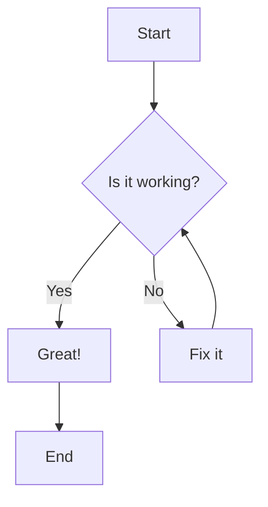

# Quick Start

Get up and running with the Template Documentation in minutes!

## Development Workflow

### Using Task (Recommended)

This project includes a `Taskfile.yml` for easy task management. Install [Task](https://taskfile.dev/#/installation) first, then:

```bash
# Show all available tasks
task help

# Set up development environment
task setup

# Start development server
task serve

# Build documentation
task build

# Build with PDF export
task build-pdf
```

### 1. Start the Development Server

**With Task:**
```bash
task serve
```

**Without Task:**
```bash
mkdocs serve
```

This command:
- Starts a local development server at `http://localhost:8000`
- Automatically reloads when you make changes
- Provides live preview of your documentation

### 2. Edit Documentation

Navigate to the `docs/` directory and start editing Markdown files:

```bash
docs/
├── index.md                # Homepage
├── getting-started/        # Getting started section
├── user-guide/            # User documentation
├── api/                   # API reference
└── contributing/          # Contribution guidelines
```

### 3. Preview Changes

Open your browser to `http://localhost:8000` to see your changes in real-time.

## Basic Commands

### With Task (Recommended)

| Task Command | Description |
|--------------|-------------|
| `task serve` | Start development server |
| `task build` | Build static site |
| `task build-pdf` | Build with PDF export |
| `task check` | Run all validation checks |
| `task clean` | Clean build artifacts |
| `task help` | Show all available tasks |

### Without Task

| Command | Description |
|---------|-------------|
| `mkdocs serve` | Start development server |
| `mkdocs build` | Build static site |
| `mkdocs --help` | Show help information |

## Creating Content

### Adding New Pages

1. Create a new Markdown file in the appropriate directory
2. Add it to the navigation in `mkdocs.yml`:

```yaml
nav:
  - Home: index.md
  - Your New Page: path/to/new-page.md
```

### Using Markdown Extensions

This template supports many advanced Markdown features:

#### Admonitions

```markdown
!!! note "Important Information"
    This is a note admonition with custom title.

!!! warning
    This is a warning without custom title.
```

!!! note "Important Information"
    This is a note admonition with custom title.

!!! warning
    This is a warning without custom title.

#### Code Blocks with Syntax Highlighting

```python title="example.py" linenums="1"
def hello_world():
    """A simple hello world function."""
    print("Hello, World!")
    return "Hello, World!"

if __name__ == "__main__":
    hello_world()
```

#### Mermaid Diagrams



#### Tables with Sorting

| Feature | Status | Priority |
|---------|--------|----------|
| Git Revision Tracking | ✅ Complete | High |
| PDF Export | ✅ Complete | High |
| TOC Generation | ✅ Complete | Medium |
| Search | ✅ Complete | High |

## Building for Production

### Standard Build

```bash
mkdocs build
```

This creates a `site/` directory with static HTML files.

### Build with PDF Export

```bash
ENABLE_PDF_EXPORT=1 mkdocs build
```

This generates both the HTML site and a PDF version in `site/pdf/documentation.pdf`.

## Git Integration Features

### Automatic Revision Tracking

Each page automatically shows:
- Last updated date
- Contributors who modified the page
- Git revision information

### Commit Message Standards

This template follows conventional commits. Use these prefixes:

- `feat:` - New features
- `fix:` - Bug fixes
- `docs:` - Documentation changes
- `style:` - Code style changes
- `refactor:` - Code refactoring
- `test:` - Test changes
- `chore:` - Maintenance tasks

Example commit messages:
```bash
git commit -m "docs: add installation guide"
git commit -m "feat: add PDF export functionality"
git commit -m "fix: resolve navigation issue"
```

## Customization

### Theme Customization

Edit `mkdocs.yml` to customize:
- Site colors and theme
- Navigation structure
- Plugin configurations
- Social links and analytics

### Adding Custom CSS/JS

1. Create files in `docs/stylesheets/` or `docs/javascripts/`
2. Reference them in `mkdocs.yml`:

```yaml
extra_css:
  - stylesheets/extra.css
extra_javascript:
  - javascripts/custom.js
```

## Next Steps

- Read the [Configuration Guide](configuration.md) for advanced setup
- Explore the [User Guide](../user-guide/overview.md) for detailed features
- Check out [Contributing Guidelines](../contributing/guidelines.md) to contribute

## Getting Help

- 📖 [MkDocs Documentation](https://www.mkdocs.org/)
- 🎨 [Material Theme Docs](https://squidfunk.github.io/mkdocs-material/)
- 🐛 [Report Issues](https://github.com/your-username/template-doc/issues)
